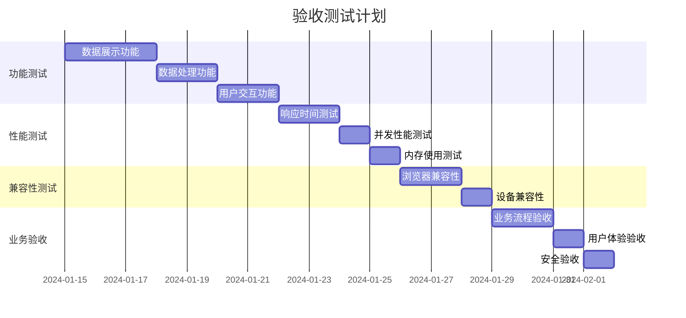

# 车险变动成本明细分析系统 - 验收标准

> **主文档**: [PRD产品需求文档](../../prd.md) - 🎯 **核心入口**  
> **文档索引**: [完整文档导航](../index.md)  
> **本文档在主PRD中的位置**: [项目实施 > 验收标准](../../prd.md#📋-项目实施)

## 1. 北极星指标验收标准

### 1.1 分析路径完成时间验收
**目标**: 一次分析路径（选择维度→指标→图表→导出）全流程完成 ≤ 30秒

**验收条件**:
- [ ] **端到端时间测量**: 从用户开始操作到获得可用结果的总时间
- [ ] **分步骤时间控制**:
  - 维度选择响应时间 ≤ 2秒
  - 指标选择响应时间 ≤ 2秒
  - 图表生成时间 ≤ 5秒
  - 数据导出时间 ≤ 3秒
  - 其他交互响应时间 ≤ 1秒
- [ ] **性能基准测试**: 在标准测试环境下连续测试100次，95%的操作在30秒内完成

**测试用例**:
```typescript
// 分析路径性能测试
describe('分析路径完成时间验收', () => {
  test('完整分析路径应在30秒内完成', async () => {
    const startTime = Date.now();
    
    // 1. 选择维度
    await selectDimensions(['week_number', 'chengdu_branch', 'insurance_type']);
    
    // 2. 选择指标
    await selectMetrics(['expired_net_premium_in_10k', 'expired_loss_ratio']);
    
    // 3. 生成图表
    await generateChart('line_chart');
    
    // 4. 导出数据
    await exportData('csv');
    
    const totalTime = Date.now() - startTime;
    expect(totalTime).toBeLessThan(30000); // 30秒
  });
  
  test('各步骤响应时间应符合要求', async () => {
    // 测试各个步骤的响应时间
    const dimensionTime = await measureDimensionSelectionTime();
    expect(dimensionTime).toBeLessThan(2000);
    
    const metricTime = await measureMetricSelectionTime();
    expect(metricTime).toBeLessThan(2000);
    
    const chartTime = await measureChartGenerationTime();
    expect(chartTime).toBeLessThan(5000);
  });
});
```

### 1.2 维度/指标复用率验收
**目标**: 同一维度/指标的复用率 ≥ 60%

**验收条件**:
- [ ] **复用率统计**: 系统能准确统计维度和指标的使用频次
- [ ] **复用率计算**: 复用率 = (重复使用次数 / 总使用次数) × 100%
- [ ] **快捷功能验证**:
  - 最近使用的维度组合（TOP5）功能正常
  - 快捷模板功能可用且被频繁使用
  - 收藏的指标集合功能正常
- [ ] **用户行为分析**: 通过埋点数据验证用户的实际复用行为

**测试用例**:
```typescript
// 复用率验收测试
describe('维度/指标复用率验收', () => {
  test('应正确统计维度组合的使用频次', () => {
    const usageStats = getUsageStatistics();
    const reusageRate = calculateReusageRate(usageStats.dimensions);
    expect(reusageRate).toBeGreaterThanOrEqual(60);
  });
  
  test('快捷模板应提高复用率', () => {
    const templateUsage = getTemplateUsageStats();
    const templateReusageRate = calculateTemplateReusageRate(templateUsage);
    expect(templateReusageRate).toBeGreaterThanOrEqual(70); // 模板复用率应更高
  });
  
  test('收藏集合应被频繁使用', () => {
    const favoriteUsage = getFavoriteCollectionUsage();
    expect(favoriteUsage.totalUsage).toBeGreaterThan(0);
    expect(favoriteUsage.averageUsagePerCollection).toBeGreaterThan(5);
  });
});
```

### 1.3 用户体验验收
**验收条件**:
- [ ] **操作流畅性**: 选择器间切换无明显延迟
- [ ] **智能推荐**: 系统能根据历史使用情况智能推荐维度和指标
- [ ] **错误处理**: 操作失败时有明确的错误提示和恢复建议
- [ ] **进度反馈**: 长时间操作有进度条或加载提示

## 2. 功能验收标准

### 1.1 数据展示功能

#### 1.1.1 多维度筛选系统
**验收条件**:
- [ ] **筛选维度完整性**: 支持所有16个数据维度的筛选
  - 时间维度: 年、月、周、日
  - 地理维度: 省份、城市、区县
  - 产品维度: 险种、渠道、客户类型
  - 业务维度: 保单状态、理赔状态、风险等级等
- [ ] **筛选交互**: 支持单选、多选、范围选择
- [ ] **筛选联动**: 维度间筛选条件正确联动
- [ ] **筛选重置**: 一键清空所有筛选条件
- [ ] **筛选保存**: 支持筛选条件的保存和加载

**测试用例**:
```typescript
// 筛选功能测试
describe('多维度筛选系统', () => {
  test('应支持所有维度筛选', () => {
    // 验证16个维度都可以正常筛选
    const dimensions = ['year', 'month', 'province', 'city', 'channel', ...];
    dimensions.forEach(dim => {
      expect(filterSystem.canFilter(dim)).toBe(true);
    });
  });
  
  test('筛选条件应正确联动', () => {
    // 选择省份后，城市列表应更新
    filterSystem.selectProvince('广东省');
    const cities = filterSystem.getAvailableCities();
    expect(cities).toContain('深圳市');
    expect(cities).not.toContain('北京市');
  });
});
```

#### 1.1.2 KPI指标体系
**验收条件**:
- [ ] **指标计算准确性**: 所有KPI指标计算结果与财务系统一致
  - 保费收入: 误差 < 0.01%
  - 赔付支出: 误差 < 0.01%
  - 变动成本: 误差 < 0.01%
  - 成本率: 误差 < 0.1%
  - 利润率: 误差 < 0.1%
  - 增长率: 误差 < 0.1%
- [ ] **指标展示**: 支持数值、百分比、趋势等多种展示方式
- [ ] **指标钻取**: 支持从汇总到明细的逐层钻取
- [ ] **指标对比**: 支持同比、环比、目标对比

**验证方法**:
```sql
-- 数据准确性验证SQL
SELECT 
  '保费收入' as 指标名称,
  财务系统.保费收入,
  分析系统.保费收入,
  ABS(财务系统.保费收入 - 分析系统.保费收入) / 财务系统.保费收入 * 100 as 误差百分比
FROM 财务系统数据 财务系统
JOIN 分析系统数据 分析系统 ON 财务系统.日期 = 分析系统.日期
WHERE 误差百分比 > 0.01; -- 应返回空结果
```

#### 1.1.3 多视图分析系统
**验收条件**:
- [ ] **图表类型**: 支持柱状图、折线图、饼图、散点图、热力图
- [ ] **视图切换**: 各视图间切换流畅，数据一致
- [ ] **交互功能**: 支持缩放、拖拽、悬停提示
- [ ] **导出功能**: 支持图片、PDF、Excel导出
- [ ] **响应式设计**: 在不同屏幕尺寸下正常显示

### 1.2 数据处理功能

#### 1.2.1 实时数据更新
**验收条件**:
- [ ] **更新频率**: 数据更新延迟 < 5分钟
- [ ] **增量更新**: 支持增量数据更新，避免全量刷新
- [ ] **更新提示**: 数据更新时有明确的用户提示
- [ ] **版本控制**: 支持数据版本管理和回滚

#### 1.2.2 数据质量保证
**验收条件**:
- [ ] **完整性检查**: 检测缺失数据并提供处理建议
- [ ] **一致性检查**: 验证数据间的逻辑一致性
- [ ] **准确性检查**: 与源系统数据进行校验
- [ ] **异常检测**: 自动识别异常数据并标记

## 2. 性能验收标准

### 2.1 响应时间要求

| 操作类型 | 数据量级 | 目标响应时间 | 最大可接受时间 |
|----------|----------|--------------|----------------|
| **页面加载** | - | < 2秒 | < 3秒 |
| **筛选操作** | < 10万条 | < 1秒 | < 2秒 |
| **图表渲染** | < 5万点 | < 1.5秒 | < 3秒 |
| **数据导出** | < 50万条 | < 10秒 | < 30秒 |
| **复杂计算** | 全量数据 | < 5秒 | < 10秒 |

**性能测试脚本**:
```javascript
// 性能测试用例
describe('性能验收测试', () => {
  test('页面加载时间应小于2秒', async () => {
    const startTime = Date.now();
    await page.goto('/dashboard');
    await page.waitForSelector('.dashboard-loaded');
    const loadTime = Date.now() - startTime;
    expect(loadTime).toBeLessThan(2000);
  });
  
  test('筛选操作响应时间应小于1秒', async () => {
    const startTime = Date.now();
    await page.click('.filter-province');
    await page.waitForSelector('.filter-results');
    const responseTime = Date.now() - startTime;
    expect(responseTime).toBeLessThan(1000);
  });
});
```

### 2.2 并发性能要求

**验收条件**:
- [ ] **并发用户**: 支持100个并发用户同时访问
- [ ] **系统稳定性**: 在峰值负载下系统不崩溃
- [ ] **资源使用**: CPU使用率 < 80%，内存使用率 < 70%
- [ ] **错误率**: 并发访问时错误率 < 1%

**负载测试配置**:
```yaml
# 负载测试配置
load_test:
  scenarios:
    - name: "正常负载"
      users: 50
      duration: "10m"
      ramp_up: "2m"
    - name: "峰值负载"
      users: 100
      duration: "5m"
      ramp_up: "1m"
  
  success_criteria:
    - avg_response_time < 2000ms
    - 95th_percentile < 5000ms
    - error_rate < 1%
    - cpu_usage < 80%
```

### 2.3 内存使用要求

**验收条件**:
- [ ] **内存泄漏**: 长时间运行无内存泄漏
- [ ] **内存峰值**: 单页面内存使用 < 500MB
- [ ] **垃圾回收**: 及时释放不用的数据对象
- [ ] **大数据处理**: 处理大数据集时内存使用合理

## 3. 兼容性验收标准

### 3.1 浏览器兼容性

| 浏览器 | 版本要求 | 支持程度 | 验收标准 |
|--------|----------|----------|----------|
| **Chrome** | ≥ 90 | 完全支持 | 所有功能正常 |
| **Firefox** | ≥ 88 | 完全支持 | 所有功能正常 |
| **Safari** | ≥ 14 | 完全支持 | 所有功能正常 |
| **Edge** | ≥ 90 | 完全支持 | 所有功能正常 |
| **IE 11** | - | 基础支持 | 核心功能可用 |

**兼容性测试矩阵**:
```typescript
// 浏览器兼容性测试
const browsers = [
  { name: 'Chrome', version: '90+' },
  { name: 'Firefox', version: '88+' },
  { name: 'Safari', version: '14+' },
  { name: 'Edge', version: '90+' }
];

browsers.forEach(browser => {
  describe(`${browser.name} ${browser.version}`, () => {
    test('核心功能应正常工作', () => {
      // 测试数据加载、筛选、图表显示等核心功能
    });
    
    test('UI显示应正确', () => {
      // 测试布局、样式、响应式设计
    });
  });
});
```

### 3.2 设备兼容性

**验收条件**:
- [ ] **桌面设备**: 1920x1080及以上分辨率完美显示
- [ ] **笔记本**: 1366x768及以上分辨率正常显示
- [ ] **平板设备**: iPad及同等尺寸设备基础功能可用
- [ ] **移动设备**: 手机端提供简化版界面

### 3.3 操作系统兼容性

**验收条件**:
- [ ] **Windows**: Windows 10及以上版本
- [ ] **macOS**: macOS 10.15及以上版本
- [ ] **Linux**: 主流发行版（Ubuntu、CentOS等）

## 4. 业务验收标准

### 4.1 业务流程验收

#### 4.1.1 成本分析流程
**验收场景**:
1. **数据准备**: 用户选择分析时间范围和维度
2. **成本计算**: 系统自动计算各项变动成本
3. **结果展示**: 以图表和表格形式展示分析结果
4. **深入分析**: 支持钻取到明细数据
5. **报告生成**: 生成分析报告并支持导出

**验收标准**:
- [ ] 整个流程在5分钟内完成
- [ ] 每个步骤都有清晰的用户指引
- [ ] 支持流程中断和恢复
- [ ] 提供操作历史记录

#### 4.1.2 对比分析流程
**验收场景**:
1. **基准设定**: 选择对比基准（历史期间、目标值等）
2. **维度选择**: 选择对比维度和指标
3. **对比计算**: 计算差异和变化趋势
4. **结果解读**: 提供差异原因分析建议
5. **决策支持**: 生成决策建议报告

### 4.2 用户体验验收

#### 4.2.1 易用性要求
**验收条件**:
- [ ] **学习成本**: 新用户15分钟内掌握基本操作
- [ ] **操作效率**: 熟练用户3分钟内完成常规分析
- [ ] **错误恢复**: 操作错误时提供明确的恢复指引
- [ ] **帮助系统**: 提供完整的在线帮助和操作指南

#### 4.2.2 可访问性要求
**验收条件**:
- [ ] **键盘导航**: 支持纯键盘操作
- [ ] **屏幕阅读器**: 兼容主流屏幕阅读器
- [ ] **色彩对比**: 符合WCAG 2.1 AA级标准
- [ ] **字体大小**: 支持字体缩放到200%

### 4.3 数据安全验收

#### 4.3.1 访问控制
**验收条件**:
- [ ] **身份认证**: 支持SSO单点登录
- [ ] **权限管理**: 基于角色的访问控制(RBAC)
- [ ] **数据权限**: 按部门/区域限制数据访问范围
- [ ] **操作审计**: 记录所有用户操作日志

#### 4.3.2 数据保护
**验收条件**:
- [ ] **传输加密**: HTTPS加密传输
- [ ] **存储加密**: 敏感数据加密存储
- [ ] **数据脱敏**: 非生产环境数据脱敏
- [ ] **备份恢复**: 定期数据备份和恢复测试

## 5. 验收测试计划

### 5.1 测试阶段安排



### 5.2 验收团队组成

| 角色 | 人员 | 职责 |
|------|------|------|
| **验收负责人** | 项目经理 | 整体验收协调和决策 |
| **业务验收员** | 业务专家 | 业务功能和流程验收 |
| **技术验收员** | 技术专家 | 技术功能和性能验收 |
| **测试工程师** | QA团队 | 执行测试用例和缺陷跟踪 |
| **用户代表** | 最终用户 | 用户体验和易用性验收 |

### 5.3 验收标准判定

#### 5.3.1 通过标准
- [ ] 所有P0（关键）功能100%通过
- [ ] 所有P1（重要）功能95%以上通过
- [ ] 性能指标100%达标
- [ ] 兼容性要求100%满足
- [ ] 安全要求100%满足
- [ ] 无P0级别缺陷
- [ ] P1级别缺陷 ≤ 3个

#### 5.3.2 缺陷等级定义

| 等级 | 定义 | 影响范围 | 处理要求 |
|------|------|----------|----------|
| **P0** | 系统崩溃、数据丢失、安全漏洞 | 系统不可用 | 立即修复 |
| **P1** | 核心功能异常、性能严重不达标 | 主要功能受影响 | 24小时内修复 |
| **P2** | 一般功能异常、界面显示问题 | 部分功能受影响 | 72小时内修复 |
| **P3** | 易用性问题、优化建议 | 用户体验影响 | 后续版本修复 |

## 6. 验收文档模板

### 6.1 功能验收报告

```markdown
# 功能验收报告

## 基本信息
- **项目名称**: 车险变动成本明细分析系统
- **验收版本**: v1.0
- **验收日期**: 2024-02-01
- **验收人员**: [验收团队成员]

## 验收结果汇总
- **测试用例总数**: 156个
- **通过用例数**: 152个
- **失败用例数**: 4个
- **通过率**: 97.4%

## 功能验收详情
### 数据展示功能
- [x] 多维度筛选系统 - 通过
- [x] KPI指标体系 - 通过
- [x] 多视图分析系统 - 通过

### 发现问题
1. **P2级**: 导出Excel时中文文件名乱码
2. **P3级**: 移动端图表显示不够友好

## 验收结论
**通过** - 满足上线条件，建议修复已发现问题后发布。
```

### 6.2 性能验收报告

```markdown
# 性能验收报告

## 测试环境
- **服务器配置**: 4核8GB内存
- **网络环境**: 100Mbps带宽
- **测试工具**: JMeter + Chrome DevTools

## 性能测试结果
| 测试项目 | 目标值 | 实际值 | 结果 |
|----------|--------|--------|------|
| 页面加载时间 | < 2秒 | 1.8秒 | ✅ 通过 |
| 筛选响应时间 | < 1秒 | 0.9秒 | ✅ 通过 |
| 并发用户数 | 100人 | 120人 | ✅ 通过 |

## 验收结论
**通过** - 所有性能指标均达到或超过预期目标。
```

---

**维护说明**: 本验收标准文档应在项目开发过程中持续更新，确保验收标准与实际需求保持一致。验收完成后，应及时更新文档以反映最终的验收结果和经验总结。