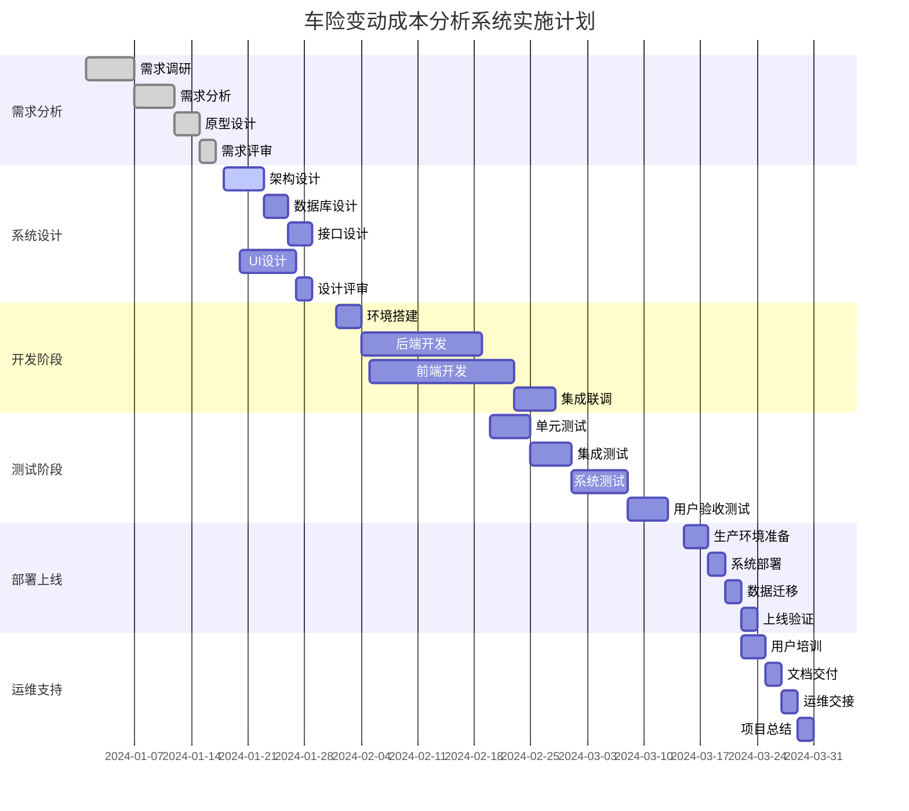
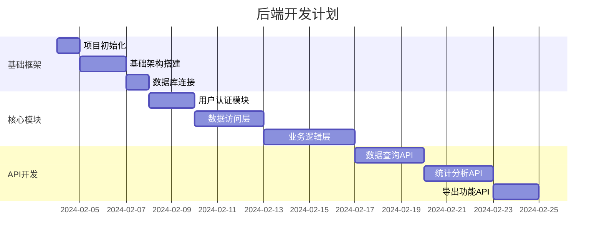
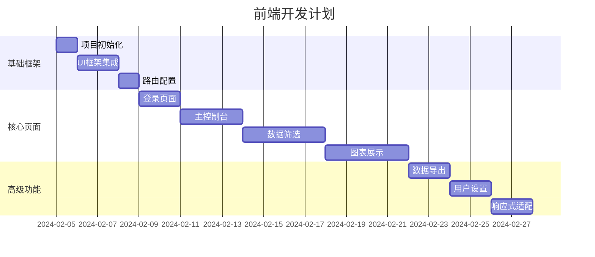
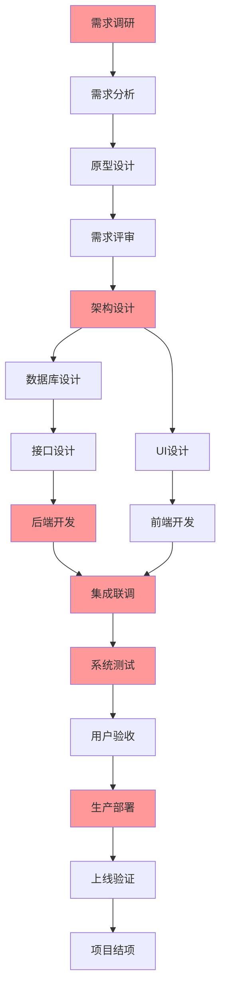
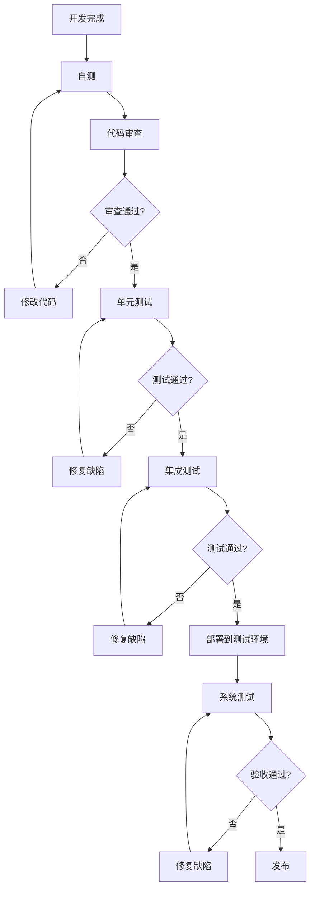

# 实施计划

## 1. 项目里程碑

### 1.1 整体时间规划



### 1.2 关键里程碑节点

| 里程碑 | 计划完成时间 | 交付物 | 验收标准 |
|--------|--------------|--------|----------|
| **需求确认** | 2024-01-17 | PRD文档、原型设计 | 业务方签字确认 |
| **设计完成** | 2024-01-31 | 技术方案、UI设计 | 技术评审通过 |
| **开发完成** | 2024-02-28 | 系统代码、部署包 | 功能测试通过 |
| **测试完成** | 2024-03-14 | 测试报告、缺陷清单 | 验收测试通过 |
| **上线完成** | 2024-03-21 | 生产系统、运维文档 | 系统稳定运行 |
| **项目结项** | 2024-03-28 | 项目总结、知识转移 | 项目验收通过 |

## 2. 详细实施计划

### 2.1 需求分析阶段 (2024-01-01 ~ 2024-01-17)

#### 2.1.1 需求调研 (7天)
**目标**: 深入了解业务需求和用户期望

**主要活动**:
- [ ] **业务调研**: 与财务、精算、业务部门深度访谈
  - 了解当前成本分析流程和痛点
  - 收集具体的分析需求和场景
  - 明确系统期望和成功标准
- [ ] **用户调研**: 与最终用户进行需求访谈
  - 了解用户的操作习惯和偏好
  - 收集界面和交互需求
  - 确定用户角色和权限需求
- [ ] **技术调研**: 评估现有系统和技术环境
  - 分析数据源系统和接口
  - 评估技术可行性和风险
  - 确定技术选型方向

**交付物**:
- 业务需求调研报告
- 用户需求调研报告
- 技术可行性分析报告

#### 2.1.2 需求分析 (5天)
**目标**: 整理和分析收集到的需求

**主要活动**:
- [ ] **需求整理**: 汇总和分类所有需求
- [ ] **需求分析**: 分析需求的合理性和优先级
- [ ] **需求建模**: 建立业务流程和数据模型
- [ ] **需求文档**: 编写详细的需求规格说明

**交付物**:
- 需求规格说明书
- 业务流程图
- 数据模型图

#### 2.1.3 原型设计 (3天)
**目标**: 创建系统原型验证需求理解

**主要活动**:
- [ ] **界面原型**: 设计主要界面的线框图
- [ ] **交互原型**: 设计关键交互流程
- [ ] **数据原型**: 准备示例数据和场景

**交付物**:
- 界面原型图
- 交互流程图
- 原型演示系统

#### 2.1.4 需求评审 (2天)
**目标**: 确认需求理解的准确性

**主要活动**:
- [ ] **内部评审**: 项目团队内部需求评审
- [ ] **业务评审**: 与业务方进行需求确认
- [ ] **需求冻结**: 正式冻结需求范围

**交付物**:
- 需求评审报告
- 需求确认书

### 2.2 系统设计阶段 (2024-01-18 ~ 2024-01-31)

#### 2.2.1 架构设计 (5天)
**目标**: 设计系统的整体架构

**主要活动**:
- [ ] **技术选型**: 确定技术栈和框架
  - 前端: React + TypeScript + Ant Design
  - 后端: Node.js + Express + TypeScript
  - 数据库: PostgreSQL + Redis
  - 部署: Docker + Kubernetes
- [ ] **架构设计**: 设计系统整体架构
  - 分层架构设计
  - 模块划分和依赖关系
  - 数据流和控制流设计
- [ ] **性能设计**: 设计性能优化方案
  - 缓存策略设计
  - 数据分片和索引策略
  - 前端性能优化方案

**交付物**:
- 技术选型报告
- 系统架构图
- 性能设计方案

#### 2.2.2 数据库设计 (3天)
**目标**: 设计数据存储方案

**主要活动**:
- [ ] **概念模型**: 设计实体关系模型
- [ ] **逻辑模型**: 设计数据库表结构
- [ ] **物理模型**: 优化索引和分区策略
- [ ] **数据迁移**: 设计数据迁移方案

**交付物**:
- 数据库设计文档
- DDL脚本
- 数据迁移方案

#### 2.2.3 接口设计 (3天)
**目标**: 设计系统接口规范

**主要活动**:
- [ ] **API设计**: 设计RESTful API接口
- [ ] **数据格式**: 定义请求和响应格式
- [ ] **接口文档**: 编写详细的接口文档
- [ ] **Mock服务**: 搭建Mock服务支持前端开发

**交付物**:
- API接口文档
- 接口规范说明
- Mock服务

#### 2.2.4 UI设计 (7天)
**目标**: 设计用户界面和交互

**主要活动**:
- [ ] **视觉设计**: 设计界面视觉风格
- [ ] **交互设计**: 设计用户交互流程
- [ ] **响应式设计**: 适配不同屏幕尺寸
- [ ] **设计规范**: 建立UI设计规范

**交付物**:
- UI设计稿
- 交互设计说明
- 设计规范文档

#### 2.2.5 设计评审 (2天)
**目标**: 评审和确认设计方案

**主要活动**:
- [ ] **技术评审**: 技术方案评审
- [ ] **设计评审**: UI/UX设计评审
- [ ] **方案优化**: 根据评审意见优化方案

**交付物**:
- 设计评审报告
- 最终设计方案

### 2.3 开发阶段 (2024-02-01 ~ 2024-02-28)

#### 2.3.1 环境搭建 (3天)
**目标**: 搭建开发和测试环境

**主要活动**:
- [ ] **开发环境**: 搭建本地开发环境
  - 配置开发工具和IDE
  - 安装依赖包和框架
  - 配置代码规范和检查工具
- [ ] **测试环境**: 搭建集成测试环境
  - 部署应用服务器
  - 配置数据库和缓存
  - 设置CI/CD流水线
- [ ] **代码仓库**: 初始化代码仓库
  - 创建Git仓库和分支策略
  - 配置代码审查流程
  - 设置自动化构建

**交付物**:
- 开发环境配置文档
- 测试环境部署文档
- CI/CD配置文件

#### 2.3.2 后端开发 (15天)
**目标**: 开发后端服务和API

**开发计划**:


**主要功能模块**:
- [ ] **用户认证**: 实现用户登录和权限控制
- [ ] **数据访问**: 实现数据查询和缓存
- [ ] **业务计算**: 实现成本分析和统计计算
- [ ] **API服务**: 实现RESTful API接口
- [ ] **数据导出**: 实现Excel和PDF导出

**交付物**:
- 后端服务代码
- API接口实现
- 单元测试用例

#### 2.3.3 前端开发 (18天)
**目标**: 开发前端界面和交互

**开发计划**:


**主要功能模块**:
- [ ] **用户界面**: 实现主要页面和组件
- [ ] **数据筛选**: 实现多维度筛选功能
- [ ] **图表展示**: 实现各种图表和可视化
- [ ] **交互功能**: 实现用户交互和操作
- [ ] **性能优化**: 实现前端性能优化

**交付物**:
- 前端应用代码
- 组件库和样式
- 前端测试用例

#### 2.3.4 集成联调 (5天)
**目标**: 前后端集成和接口联调

**主要活动**:
- [ ] **接口联调**: 前后端接口对接和调试
- [ ] **数据联调**: 真实数据的集成测试
- [ ] **功能联调**: 端到端功能测试
- [ ] **问题修复**: 修复集成过程中发现的问题

**交付物**:
- 集成测试报告
- 问题修复记录
- 完整系统代码

### 2.4 测试阶段 (2024-03-01 ~ 2024-03-14)

#### 2.4.1 单元测试 (5天)
**目标**: 验证各个模块的功能正确性

**测试范围**:
- [ ] **后端单元测试**: 测试业务逻辑和数据访问
- [ ] **前端单元测试**: 测试组件和工具函数
- [ ] **API测试**: 测试接口的输入输出
- [ ] **数据库测试**: 测试数据操作的正确性

**测试目标**:
- 代码覆盖率 ≥ 80%
- 所有核心功能通过测试
- 无P0和P1级别缺陷

#### 2.4.2 集成测试 (5天)
**目标**: 验证系统各模块间的集成

**测试范围**:
- [ ] **模块集成**: 测试前后端模块集成
- [ ] **数据集成**: 测试数据流的完整性
- [ ] **接口集成**: 测试API接口的集成
- [ ] **第三方集成**: 测试外部系统集成

#### 2.4.3 系统测试 (7天)
**目标**: 验证系统的整体功能和性能

**测试类型**:
- [ ] **功能测试**: 验证所有功能需求
- [ ] **性能测试**: 验证系统性能指标
- [ ] **兼容性测试**: 验证浏览器和设备兼容性
- [ ] **安全测试**: 验证系统安全性
- [ ] **易用性测试**: 验证用户体验

#### 2.4.4 用户验收测试 (5天)
**目标**: 业务用户验收系统功能

**验收活动**:
- [ ] **功能验收**: 业务用户验收功能
- [ ] **性能验收**: 验收系统性能表现
- [ ] **易用性验收**: 验收用户体验
- [ ] **培训验收**: 验收用户培训效果

### 2.5 部署上线阶段 (2024-03-15 ~ 2024-03-21)

#### 2.5.1 生产环境准备 (3天)
**目标**: 准备生产环境和部署资源

**主要活动**:
- [ ] **环境搭建**: 搭建生产服务器环境
- [ ] **安全配置**: 配置防火墙和安全策略
- [ ] **监控配置**: 配置系统监控和告警
- [ ] **备份配置**: 配置数据备份策略

#### 2.5.2 系统部署 (2天)
**目标**: 部署系统到生产环境

**部署步骤**:
1. [ ] **代码部署**: 部署应用代码到生产服务器
2. [ ] **数据库部署**: 创建生产数据库和表结构
3. [ ] **配置部署**: 部署生产环境配置文件
4. [ ] **服务启动**: 启动应用服务和相关组件

#### 2.5.3 数据迁移 (2天)
**目标**: 迁移历史数据到新系统

**迁移步骤**:
1. [ ] **数据导出**: 从源系统导出历史数据
2. [ ] **数据清洗**: 清洗和转换数据格式
3. [ ] **数据导入**: 导入数据到新系统
4. [ ] **数据验证**: 验证数据迁移的完整性和准确性

#### 2.5.4 上线验证 (2天)
**目标**: 验证系统在生产环境的正常运行

**验证内容**:
- [ ] **功能验证**: 验证核心功能正常工作
- [ ] **性能验证**: 验证系统性能满足要求
- [ ] **数据验证**: 验证数据的准确性和完整性
- [ ] **安全验证**: 验证系统安全配置有效

### 2.6 运维支持阶段 (2024-03-22 ~ 2024-03-28)

#### 2.6.1 用户培训 (3天)
**目标**: 培训最终用户使用系统

**培训内容**:
- [ ] **基础操作**: 系统登录和基本操作
- [ ] **功能使用**: 各功能模块的使用方法
- [ ] **高级功能**: 高级分析和报告功能
- [ ] **问题处理**: 常见问题的处理方法

**培训方式**:
- 现场培训 + 在线培训
- 操作手册 + 视频教程
- 实际操作 + 答疑解惑

#### 2.6.2 文档交付 (2天)
**目标**: 交付完整的项目文档

**文档清单**:
- [ ] **用户手册**: 系统使用说明和操作指南
- [ ] **管理员手册**: 系统管理和维护指南
- [ ] **技术文档**: 系统架构和开发文档
- [ ] **运维文档**: 部署和运维操作手册

#### 2.6.3 运维交接 (2天)
**目标**: 向运维团队交接系统

**交接内容**:
- [ ] **系统架构**: 介绍系统架构和组件
- [ ] **运维流程**: 交接日常运维流程
- [ ] **监控告警**: 交接监控和告警配置
- [ ] **应急处理**: 交接应急处理流程

#### 2.6.4 项目总结 (2天)
**目标**: 总结项目经验和成果

**总结内容**:
- [ ] **项目回顾**: 回顾项目执行过程
- [ ] **成果总结**: 总结项目交付成果
- [ ] **经验教训**: 总结项目经验和教训
- [ ] **改进建议**: 提出后续改进建议

## 3. 关键路径分析

### 3.1 关键路径识别



**关键路径**: 需求调研 → 架构设计 → 后端开发 → 集成联调 → 系统测试 → 生产部署

### 3.2 风险控制点

| 关键节点 | 主要风险 | 控制措施 | 应急预案 |
|----------|----------|----------|----------|
| **需求调研** | 需求理解偏差 | 多轮确认，原型验证 | 快速迭代调整 |
| **架构设计** | 技术选型错误 | 技术预研，专家评审 | 备选方案准备 |
| **后端开发** | 开发进度延迟 | 每日站会，风险预警 | 增加人力资源 |
| **集成联调** | 接口不匹配 | 提前Mock，持续集成 | 紧急修复流程 |
| **系统测试** | 缺陷数量过多 | 代码审查，自动化测试 | 延期修复计划 |
| **生产部署** | 部署失败 | 部署演练，回滚预案 | 快速回滚机制 |

### 3.3 进度监控机制

#### 3.3.1 日常监控
- **每日站会**: 跟踪当日进展和问题
- **周报制度**: 汇报周进展和风险
- **里程碑检查**: 关键节点进度检查

#### 3.3.2 进度指标
```typescript
// 进度监控指标
interface ProgressMetrics {
  // 整体进度
  overallProgress: number;        // 整体完成百分比
  milestoneProgress: number;      // 里程碑完成情况
  
  // 开发进度
  codeProgress: {
    backend: number;              // 后端开发进度
    frontend: number;             // 前端开发进度
    integration: number;          // 集成进度
  };
  
  // 质量指标
  qualityMetrics: {
    codeReviewRate: number;       // 代码审查率
    testCoverage: number;         // 测试覆盖率
    defectDensity: number;        // 缺陷密度
  };
  
  // 风险指标
  riskMetrics: {
    scheduleRisk: 'LOW' | 'MEDIUM' | 'HIGH';  // 进度风险
    qualityRisk: 'LOW' | 'MEDIUM' | 'HIGH';   // 质量风险
    resourceRisk: 'LOW' | 'MEDIUM' | 'HIGH';  // 资源风险
  };
}
```

## 4. 资源配置计划

### 4.1 人力资源配置

| 角色 | 人数 | 技能要求 | 参与阶段 |
|------|------|----------|----------|
| **项目经理** | 1 | 项目管理，沟通协调 | 全程参与 |
| **产品经理** | 1 | 需求分析，产品设计 | 需求-设计阶段 |
| **架构师** | 1 | 系统架构，技术选型 | 设计-开发阶段 |
| **后端开发** | 2 | Node.js，数据库 | 开发-测试阶段 |
| **前端开发** | 2 | React，TypeScript | 开发-测试阶段 |
| **UI设计师** | 1 | 界面设计，交互设计 | 设计阶段 |
| **测试工程师** | 2 | 功能测试，自动化测试 | 测试阶段 |
| **运维工程师** | 1 | 系统部署，运维监控 | 部署-运维阶段 |

### 4.2 技术资源配置

#### 4.2.1 开发环境
- **开发工具**: VS Code, WebStorm, Postman
- **版本控制**: Git + GitLab
- **项目管理**: Jira + Confluence
- **通信工具**: 钉钉 + 腾讯会议

#### 4.2.2 测试环境
- **服务器**: 4核8GB × 2台
- **数据库**: PostgreSQL 13+
- **缓存**: Redis 6+
- **负载均衡**: Nginx

#### 4.2.3 生产环境
- **服务器**: 8核16GB × 3台
- **数据库**: PostgreSQL集群
- **缓存**: Redis集群
- **监控**: Prometheus + Grafana

### 4.3 预算配置

| 项目 | 预算(万元) | 说明 |
|------|------------|------|
| **人力成本** | 120 | 10人×3个月平均成本 |
| **硬件成本** | 15 | 服务器和网络设备 |
| **软件成本** | 8 | 开发工具和第三方服务 |
| **培训成本** | 5 | 用户培训和技术培训 |
| **其他成本** | 7 | 差旅、会议等杂项 |
| **风险储备** | 15 | 10%风险储备金 |
| **总预算** | 170 | - |

## 5. 质量保证计划

### 5.1 代码质量标准

#### 5.1.1 编码规范
- **代码风格**: 使用ESLint + Prettier统一代码风格
- **命名规范**: 采用驼峰命名和语义化命名
- **注释规范**: 关键函数和复杂逻辑必须添加注释
- **文档规范**: 使用JSDoc生成API文档

#### 5.1.2 代码审查
- **审查流程**: 所有代码必须经过同行审查
- **审查标准**: 功能正确性、代码质量、性能优化
- **审查工具**: 使用GitLab MR进行代码审查

#### 5.1.3 测试要求
- **单元测试**: 核心业务逻辑覆盖率 ≥ 80%
- **集成测试**: 主要业务流程100%覆盖
- **端到端测试**: 关键用户场景自动化测试

### 5.2 质量控制流程



### 5.3 质量度量指标

| 指标类别 | 具体指标 | 目标值 | 测量方法 |
|----------|----------|--------|----------|
| **代码质量** | 代码覆盖率 | ≥ 80% | 自动化工具统计 |
| **代码质量** | 代码审查率 | 100% | GitLab统计 |
| **缺陷质量** | 缺陷密度 | ≤ 2个/KLOC | 缺陷管理工具 |
| **缺陷质量** | 缺陷修复率 | ≥ 95% | 缺陷管理工具 |
| **性能质量** | 响应时间 | ≤ 2秒 | 性能测试工具 |
| **性能质量** | 并发用户数 | ≥ 100 | 负载测试工具 |

## 6. 沟通管理计划

### 6.1 沟通矩阵

| 干系人 | 沟通内容 | 沟通频率 | 沟通方式 | 负责人 |
|--------|----------|----------|----------|--------|
| **项目发起人** | 项目进展，重大决策 | 周报 | 邮件+会议 | 项目经理 |
| **业务用户** | 需求确认，验收测试 | 按需 | 会议+演示 | 产品经理 |
| **开发团队** | 任务分配，技术讨论 | 每日 | 站会+即时通讯 | 技术负责人 |
| **测试团队** | 测试计划，缺陷跟踪 | 每日 | 会议+工具 | 测试负责人 |
| **运维团队** | 部署需求，环境配置 | 按需 | 会议+文档 | 架构师 |

### 6.2 会议计划

#### 6.2.1 定期会议
- **项目启动会**: 项目开始时召开，明确目标和计划
- **每日站会**: 开发期间每日15分钟，同步进展和问题
- **周例会**: 每周1小时，汇报进展和风险
- **里程碑评审**: 每个里程碑结束时，评审交付物
- **项目总结会**: 项目结束时，总结经验教训

#### 6.2.2 临时会议
- **需求澄清会**: 需求不明确时召开
- **技术评审会**: 重大技术决策时召开
- **问题解决会**: 遇到重大问题时召开
- **风险应对会**: 出现高风险时召开

### 6.3 文档管理

#### 6.3.1 文档分类
- **项目管理文档**: 项目计划、进度报告、会议纪要
- **需求文档**: 需求规格、用户故事、验收标准
- **设计文档**: 架构设计、接口设计、UI设计
- **开发文档**: 代码规范、API文档、部署指南
- **测试文档**: 测试计划、测试用例、测试报告

#### 6.3.2 文档管理规范
- **版本控制**: 所有文档进行版本控制
- **访问权限**: 根据角色设置文档访问权限
- **更新机制**: 建立文档更新和审批流程
- **存储位置**: 统一存储在项目协作平台

---

**维护说明**: 本实施计划应根据项目实际进展情况定期更新和调整，确保计划的可执行性和有效性。项目经理负责计划的维护和执行监控。