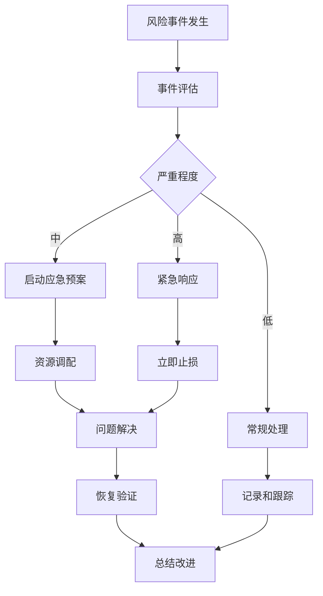

# 车险变动成本明细分析系统 - 风险管理计划

> **主文档**: [PRD产品需求文档](../../prd.md) - 🎯 **核心入口**  
> **文档索引**: [完整文档导航](../index.md)  
> **本文档在主PRD中的位置**: [项目实施 > 风险管理](../../prd.md#📋-项目实施)

## 1. 风险识别与评估

### 1.1 技术风险

| 风险项 | 风险等级 | 概率 | 影响程度 | 影响描述 |
|--------|----------|------|----------|----------|
| **大数据量性能** | 🔴 高 | 70% | 高 | 系统响应慢，用户体验差，影响业务决策效率 |
| **计算准确性** | 🔴 高 | 30% | 极高 | 业务决策错误，可能导致重大财务损失 |
| **浏览器兼容性** | 🟡 中 | 40% | 中 | 部分用户无法正常使用，影响推广效果 |
| **第三方依赖** | 🟡 中 | 50% | 中 | 功能受限，开发进度延迟 |
| **数据安全** | 🔴 高 | 20% | 极高 | 数据泄露，合规风险，法律责任 |
| **系统稳定性** | 🟡 中 | 35% | 高 | 系统崩溃，业务中断，用户流失 |

### 1.2 业务风险

| 风险项 | 风险等级 | 概率 | 影响程度 | 影响描述 |
|--------|----------|------|----------|----------|
| **需求变更** | 🟡 中 | 60% | 中 | 延期交付，成本增加，资源重新分配 |
| **用户接受度** | 🟡 中 | 40% | 高 | 推广困难，投资回报率低，项目失败 |
| **数据质量** | 🔴 高 | 50% | 极高 | 分析结果不可信，业务决策错误 |
| **培训成本** | 🟢 低 | 30% | 中 | 用户学习成本高，推广阻力大 |
| **竞争压力** | 🟡 中 | 45% | 中 | 市场竞争激烈，功能优势不明显 |

### 1.3 项目风险

| 风险项 | 风险等级 | 概率 | 影响程度 | 影响描述 |
|--------|----------|------|----------|----------|
| **人员流失** | 🟡 中 | 25% | 高 | 项目延期，知识流失，质量下降 |
| **资源不足** | 🟡 中 | 35% | 中 | 开发进度缓慢，功能缩减 |
| **时间压力** | 🔴 高 | 70% | 中 | 质量妥协，技术债务增加 |
| **沟通协调** | 🟢 低 | 20% | 中 | 需求理解偏差，返工增加 |

## 2. 风险缓解策略

### 2.1 技术风险缓解

#### 2.1.1 大数据量性能风险
**缓解措施**:
- **数据分片**: 按时间窗口限制查询范围（默认15周）
- **预聚合**: 关键指标按维度预计算，存储中间结果
- **缓存优化**: 多层缓存策略（内存、浏览器、CDN）
- **异步处理**: 大数据量计算采用Web Workers
- **性能监控**: 实时监控响应时间，设置告警阈值

**应急预案**:
- 启用数据采样模式，减少计算量
- 提供简化版界面，仅显示核心指标
- 增加服务器资源，扩展计算能力

#### 2.1.2 计算准确性风险
**缓解措施**:
- **多轮验证**: 与财务系统数据对账验证
- **自动化测试**: 建立完整的单元测试和集成测试
- **人工复核**: 关键计算逻辑人工审核
- **版本控制**: 计算公式版本化管理
- **审计日志**: 记录所有计算过程和结果

**应急预案**:
- 提供计算过程透明化展示
- 建立快速回滚机制
- 设置计算结果合理性检查

#### 2.1.3 浏览器兼容性风险
**缓解措施**:
- **渐进增强**: 核心功能优先，高级功能渐进增强
- **Polyfill**: 为旧版浏览器提供API兼容
- **降级方案**: 不支持的功能提供替代方案
- **兼容性测试**: 在主流浏览器进行全面测试

#### 2.1.4 数据安全风险
**缓解措施**:
- **访问控制**: 基于角色的权限管理(RBAC)
- **数据加密**: HTTPS传输，敏感数据加密存储
- **审计日志**: 完整的用户操作和数据访问日志
- **安全扫描**: 定期进行安全漏洞扫描
- **合规检查**: 符合数据保护法规要求

### 2.2 业务风险缓解

#### 2.2.1 需求变更风险
**缓解措施**:
- **需求冻结**: 开发阶段需求冻结，变更需正式流程
- **变更控制**: 建立变更评估和审批机制
- **敏捷开发**: 采用迭代开发，快速响应变更
- **原型验证**: 通过原型提前验证需求

#### 2.2.2 用户接受度风险
**缓解措施**:
- **用户调研**: 深入了解用户需求和使用习惯
- **原型验证**: 早期原型用户验证和反馈
- **培训支持**: 提供完整的用户培训和文档
- **分阶段推广**: 先小范围试点，再全面推广
- **持续优化**: 根据用户反馈持续改进

#### 2.2.3 数据质量风险
**缓解措施**:
- **数据校验**: 多层数据质量检查机制
- **质量监控**: 实时监控数据质量指标
- **异常告警**: 数据异常自动告警机制
- **数据治理**: 建立数据质量管理流程
- **源头控制**: 与数据提供方建立质量协议

### 2.3 项目风险缓解

#### 2.3.1 人员流失风险
**缓解措施**:
- **知识管理**: 建立完整的技术文档和知识库
- **交叉培训**: 关键技能多人掌握，避免单点依赖
- **激励机制**: 提供有竞争力的薪酬和发展机会
- **团队建设**: 营造良好的团队氛围

#### 2.3.2 时间压力风险
**缓解措施**:
- **合理规划**: 制定现实可行的项目计划
- **优先级管理**: 明确功能优先级，核心功能优先
- **资源调配**: 关键阶段增加人力资源
- **质量保证**: 不因时间压力牺牲质量标准

## 3. 外部依赖管理

### 3.1 关键依赖识别

| 依赖项 | 依赖类型 | 重要程度 | 风险等级 | 负责方 |
|--------|----------|----------|----------|--------|
| **数据源** | 业务依赖 | 极高 | 🔴 高 | 财务系统团队 |
| **网络环境** | 基础设施 | 高 | 🟡 中 | 网络运维团队 |
| **浏览器环境** | 技术依赖 | 高 | 🟡 中 | 用户端 |
| **运维支持** | 服务依赖 | 高 | 🟡 中 | 运维团队 |
| **第三方库** | 技术依赖 | 中 | 🟢 低 | 开源社区 |

### 3.2 依赖风险缓解

#### 3.2.1 数据源依赖
**风险**: 财务系统数据延迟或错误
**缓解措施**:
- 建立数据质量SLA协议
- 实现数据校验和异常检测
- 建立数据备份和恢复机制
- 与数据提供方建立沟通机制

#### 3.2.2 网络环境依赖
**风险**: 网络不稳定影响系统访问
**缓解措施**:
- 实现离线缓存功能
- 优化网络请求，减少依赖
- 提供网络状态提示
- 建立CDN加速机制

#### 3.2.3 第三方库依赖
**风险**: 第三方库更新或停止维护
**缓解措施**:
- 版本锁定，避免自动更新
- 准备备选方案或自研替代
- 定期评估依赖库的健康度
- 建立依赖库升级测试流程

## 4. 风险监控与预警

### 4.1 监控指标体系

```typescript
// 风险监控指标
interface RiskMetrics {
  // 性能风险指标
  performance: {
    responseTime: number;      // 响应时间
    errorRate: number;         // 错误率
    throughput: number;        // 吞吐量
    memoryUsage: number;       // 内存使用率
  };
  
  // 质量风险指标
  quality: {
    dataAccuracy: number;      // 数据准确率
    calculationErrors: number; // 计算错误数
    userComplaints: number;    // 用户投诉数
  };
  
  // 业务风险指标
  business: {
    userAdoption: number;      // 用户采用率
    usageFrequency: number;    // 使用频率
    featureUtilization: number; // 功能利用率
  };
}
```

### 4.2 预警机制

```typescript
// 风险预警系统
class RiskAlertSystem {
  private thresholds = {
    responseTime: 2000,        // 响应时间阈值(ms)
    errorRate: 0.05,          // 错误率阈值(5%)
    dataAccuracy: 0.999,      // 数据准确率阈值(99.9%)
    memoryUsage: 0.8          // 内存使用率阈值(80%)
  };
  
  checkRiskMetrics(metrics: RiskMetrics) {
    // 性能风险检查
    if (metrics.performance.responseTime > this.thresholds.responseTime) {
      this.triggerAlert('PERFORMANCE', '响应时间超过阈值', 'HIGH');
    }
    
    // 质量风险检查
    if (metrics.quality.dataAccuracy < this.thresholds.dataAccuracy) {
      this.triggerAlert('QUALITY', '数据准确率低于阈值', 'CRITICAL');
    }
    
    // 业务风险检查
    if (metrics.business.userAdoption < 0.5) {
      this.triggerAlert('BUSINESS', '用户采用率偏低', 'MEDIUM');
    }
  }
  
  private triggerAlert(type: string, message: string, severity: string) {
    // 发送告警通知
    console.log(`[${severity}] ${type}: ${message}`);
    // 实际实现中会发送邮件、短信或推送通知
  }
}
```

## 5. 应急响应计划

### 5.1 应急响应流程



### 5.2 应急联系人

| 角色 | 姓名 | 联系方式 | 职责范围 |
|------|------|----------|----------|
| **项目经理** | 张三 | 138xxxx1234 | 整体协调，决策支持 |
| **技术负责人** | 李四 | 139xxxx5678 | 技术问题处理 |
| **运维负责人** | 王五 | 137xxxx9012 | 系统运维，故障恢复 |
| **业务负责人** | 赵六 | 136xxxx3456 | 业务影响评估 |
| **数据负责人** | 钱七 | 135xxxx7890 | 数据质量问题 |

### 5.3 应急资源清单

- **技术资源**: 备用服务器、开发环境、测试环境
- **人力资源**: 应急开发团队、外部技术支持
- **工具资源**: 监控工具、诊断工具、恢复工具
- **文档资源**: 应急手册、联系清单、恢复流程

## 6. 风险管理检查清单

### 6.1 项目启动阶段
- [ ] 完成风险识别和评估
- [ ] 制定风险缓解策略
- [ ] 建立风险监控机制
- [ ] 准备应急响应预案
- [ ] 确定风险责任人

### 6.2 开发阶段
- [ ] 定期风险评估和更新
- [ ] 监控关键风险指标
- [ ] 执行风险缓解措施
- [ ] 记录风险事件和处理
- [ ] 团队风险意识培训

### 6.3 测试阶段
- [ ] 验证风险缓解效果
- [ ] 测试应急响应流程
- [ ] 评估残余风险水平
- [ ] 更新风险管理文档
- [ ] 准备上线风险评估

### 6.4 上线阶段
- [ ] 激活监控和告警系统
- [ ] 确认应急响应就绪
- [ ] 建立风险沟通机制
- [ ] 定期风险回顾会议
- [ ] 持续风险管理优化

---

**维护说明**: 本风险管理计划应根据项目进展和实际情况定期更新，确保风险管理措施的有效性和时效性。